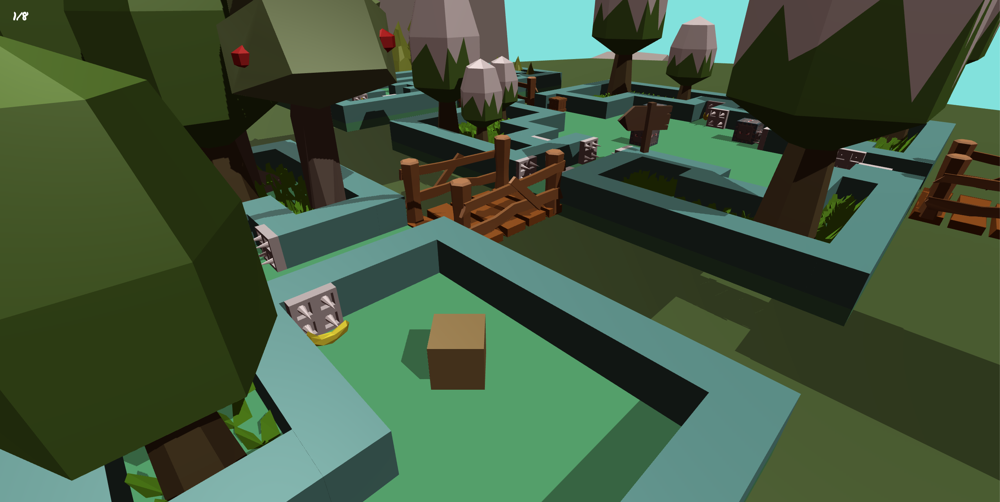

# 🎮 Cubes Venture


<p align="center">
  
</p>

**Cubes Venture** is a 3D adventure game where players must collect a specific number of keys to progress through increasingly difficult levels. Along the way, players will encounter various traps, enemies, and obstacles, all designed to challenge their skills and strategy. The game features custom traps created in Blender, dynamic enemy AI, and a comprehensive inventory system to enhance the gameplay experience.

## 🚀 Features

- **Dynamic Levels**: Progress through levels that become more challenging as you advance, requiring more keys to unlock doors and move to the next stage.
    
- **Custom Traps**: Navigate through unique traps designed in Blender, strategically placed to test your reflexes and decision-making skills.
    
- **Player Movement and Controls**: Smooth and responsive player movement, including mouse and keyboard input, ensures an immersive gameplay experience.
    
- **Enemy AI**: Encounter enemies with patrol behaviors that actively seek to challenge the player, adding an extra layer of difficulty.
    
- **Inventory System**: Manage and utilize collected items, such as keys, to overcome obstacles and unlock doors. The inventory system allows players to track and manage their resources efficiently.
    
- **Interactive Environment**: Engage with various in-game objects, such as doors and interactive texts, to progress through levels. The game also features a pause menu to allow players to take a break when needed.
    
- **Sound and Music**: Enjoy an atmospheric soundtrack and sound effects that enhance the immersive experience, managed through a dynamic audio system.
    
- **Third-Person Camera**: Experience the game from a third-person perspective, providing a comprehensive view of the environment and better control over character movement.
    

## 🛠️ Key Scripts

- **Player Movement (Movement.cs)**: Controls the player's movement and interaction with the environment.
    
- **Patrol.cs**: Governs enemy movement patterns, creating challenging AI behaviors.
    
- **PickKey.cs**: Manages the key collection mechanic, essential for progressing through levels.
    
- **OpenTheDoor.cs / DoorScript.cs**: Handles the logic for opening doors once the required number of keys is collected.
    
- **Trap.cs**: Implements traps designed in Blender, adding perilous obstacles for the player to overcome.
    
- **InteractText.cs / InteractScript.cs**: Displays interactive text and handles player interactions with important objects.
    
- **MainMenu.cs / PauseMenu.cs**: Manages the game's main menu and pause menu, allowing players to start new games, adjust settings, or pause the game during play.
    
- **Inventory.cs**: Manages the player's inventory, allowing for the collection and usage of items such as keys.
    
- **Sound.cs / AudioManager.cs**: Manages the audio for the game, including background music and sound effects.
    
- **zoomCam.cs / ThirdPersonCamera.cs**: Provides camera zoom functionality and controls the third-person camera perspective to enhance the player's view of the environment.
    
- **LevelLoader.cs**: Manages the transition between levels, ensuring a smooth flow as the player progresses through the game.
    
- **Destroy.cs**: Handles the destruction of objects, such as traps or enemies, when certain conditions are met.
    
- **GameManager1.cs**: Oversees the overall game state, ensuring that all game systems work together seamlessly.
    

## 📦 Installation

1. **Clone the Repository**:
```bash 
git clone https://github.com/YourUsername/CubesVenture.git 
cd CubesVenture
```

2. **Open in Unity**:
    - Open Unity Hub and add the `CubesVenture` project.
    - Load the project in Unity Editor.

3. **Build and Play**:
    - Use Unity's build settings to configure your platform (e.g., PC, Mac, Linux).
    - Click on "Build and Run" to start playing the game.


## 📄 License

This project is licensed under the MIT License - see the LICENSE file for details.